# Tiny Combat Tools

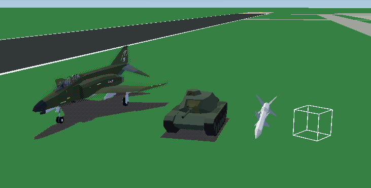

This is a Unity project designed to help make the addition of new assets into the game [Tiny Combat Arena](https://store.steampowered.com/app/1347550/Tiny_Combat_Arena/) easier. It uses the same shaders and environment as the real game, allowing you to preview exactly what your model will look like, and correct any mistakes with the model before importing it into the game.

This project is built on Unity **2020.3.30f1**. While any 2020.3 LTS version should work, it's highly recommended to stick with **2020.3.30f1**, as it's what the game is built on.

[Download the required Unity version here.](https://download.unity3d.com/download_unity/1fb1bf06830e/UnityDownloadAssistant-2020.3.30f1.exe)

## Installing

### Git & Unity Hub

This is the recommended way as it's easiest to update.

1. Check out this repository
2. Using Unity Hub, add the repository as a project
3. Open the project through Unity Hub

### Manual

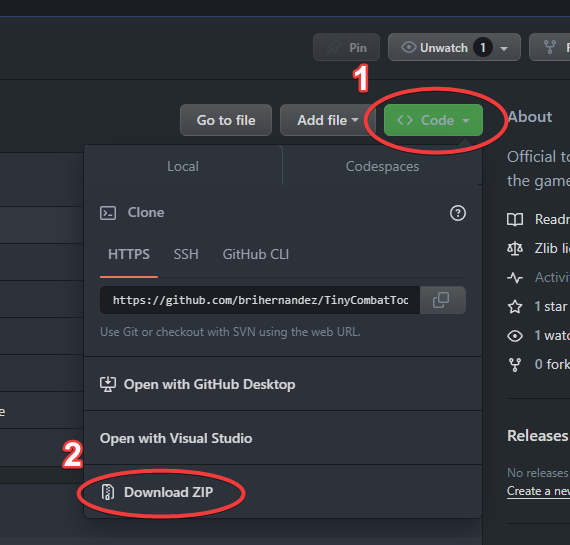

1. [Download Unity 2020.3.30f1](https://download.unity3d.com/download_unity/1fb1bf06830e/UnityDownloadAssistant-2020.3.30f1.exe)
1. Click on the Code button on this GitHub page
2. Download the [Zip file of the project](https://github.com/brihernandez/TinyCombatTools/archive/refs/heads/master.zip)
3. Extract the `TinyCombatTools-master` folder to some directory
4. Using Unity Hub, add the repository as a project
5. Open the project through Unity Hub

## TCA Mod Builder

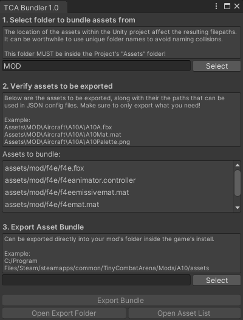

The main feature of this toolset is the **TCA Mod Builder**. It allows for the creation of mods that can be loaded into the Tiny Combat Arena Mod Manager. Valid mods can then be uploaded to [the game's Steam Workshop page](https://steamcommunity.com/app/1347550/workshop/).

A mod consists of the `mod.json`, describing the properties of the mod. Mods also usually contain an asset bundle that can be automatically built from this tool.

### How to use the TCA Mod Builder to create a simple mod

For this example, the exported mod will be called `A10Warthog`, but the name can be anything of your choosing.

1. Open the `DemoScene` view view examples in their native environment.
2. Import whatever models you plan to export to the game.
3. Open the Mod Builder from the dropdown menu `Tiny Combat Arena -> Open Mod Builder`.
4. Follow the export process as outlined in the Mod Builder. Make sure to fill out all the fields.
5. Set the path to your mod's folder, which will look something like `C:/Program Files/Steam/steamapps/common/TinyCombatArena/Mods/A10Warthog`
6. Click the `Export Mod` button to export the `mod.json`, `assetlist.json`, and asset bundle.
7. Referencing `assetlist.json`, apply asset paths where desired in your mod's data files.

### What the Mod Builder **DOES** do

* Can be used to create a template for a mod that can be loaded ingame.
* Can export various assets such as weapon, vehicle, and aircraft models to the game.
* Can update a mod you've already created with new assets

### What the Mod Builder **DOES NOT** do

* Does not create the data files necessary in your mod to use the assets you exported. You must do this yourself through editing the relevant json files. Reference game's core data for examples.
* Does not upload your mod to Steam Workshop. This must be done ingame.

### How to use exported assets

Exported assets must be referenced by a very specific path that can be found in the `assetlist.json` file. A typical `assetlist.json` will look something like this:

```
assets/mod_attack/preview.png
assets/mod_attack/thumb.png
assets/mod_attack/aircraft/a10a/a10a.fbx
assets/mod_attack/aircraft/a10a/a10mat.mat
assets/mod_attack/aircraft/a10a/a10palette.png
assets/mod_attack/aircraft/a10a/a10aanimator.controller
```

In the below example usage in an aircraft definition, notice how the `ModelPath` and `AnimatorPath` use the full filenames. **The full path as listed in `assetlist.json` must be used, including extensions!**

```json
"Name": "A10A",
"DisplayName": "A-10A",
"DotColors": [130, 141, 154],

"ModelPath": "assets/mod/aircraft/a10a/a10a.fbx",
"AnimatorPath": "assets/mod/aircraft/a10a/a10aanimator.controller",
"SpawnOffset": -1.875,
"SpawnRotation": 4.1,
```

### Avoiding conflicts between mods

When mods are loaded through the game's Mod Manager, conflicts between assets can prevent a mod from being loaded. It's worth mentioning that while assets cannot have any naming collisions, it's okay for a mod's *Data* (i.e. JSONs) to override another mod's (or even the game's core) data.

Things that can cause asset conflicts are:

#### **Identical asset paths**.

Use a root folder name unique to your mod. In the above example, the name `mod_attack` is used, but the more specific the better. Consider using your name as part of the root mod folder. Naming collisions between assets of different mods will prevent a mod from being loaded!

#### **Identical asset GUIDs**

This one is harder to debug, but essentially you don't want a single asset to be used in multiple mods. For example, if you have a missile model that is shared between two different mods, consider breaking out that missile out into its own mod that is loaded *alongside* those two other mods.

Another example, is if you try to export the example F-4, M60, or SA-2, you are likely to run into a GUID conflict because these are the literal assets used by the game.

*This is getting very in the weeds, but you can force the creation of a unique GUID for an object by deleting the asset's `.meta` file and letting Unity generate a new one.*

# Uploading to Steam Workshop

PLACEHOLDER

# Reference

Below is various technical data to help format and export your models using the game's built in shaders and materials.

## Pivots and Axis Orientations

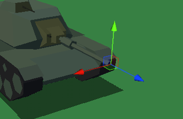

It is **critical** that a model and its child meshes have their axes set up in Unity such that:

* **X**: Right
* **Y**: Up
* **Z**: Forward

These axes **must point in these directions when the mesh is "at rest"**, meaning with no rotations applied to it other than what might be intended. Check the F-4E rotations and pivots for a fairly complex example of what a model's rotations and axes should look like.

**To accurately gauge the object orientations, ensure you have handle settings on `Pivot` and `Local`!**

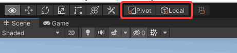

If the pivots and orientations are not correct, then the model and other gameplay behaviors will not work correctly. One of the biggest advantages of this tool existing inside a Unity project is that you can see *exactly* what your axes will look like before you export them into the game.

How you achieve this will depend on your export process and import settings, but the important thing is that in Unity, if you click on a mesh or dummy object, it shows the correct axes.

## Models Must Enable Mesh Read/Write

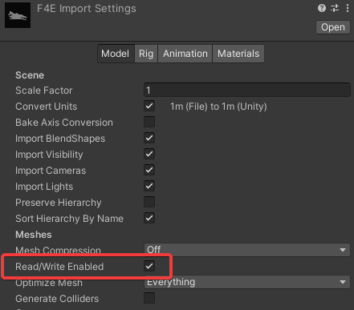

Models must have their meshes marked as `Read/Write Enabled` in order to import into the game correctly. Various bits and pieces get shuffled around at runtime, and without this setting enabled it can cause errors when aircraft and vehicles are initialized.

## Creating Materials for Your Models

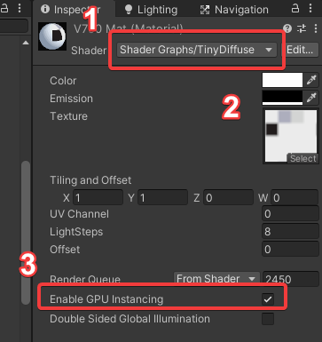

1. For most materials, use the [TinyDiffuse](#tinydiffuse) shader
2. Configure color, emission, and texture
    - **Color:** For most materials with a texture, set this white. A color can be used to modify the texture color, or to color an untextured material.
    - **Emission:** For most materials, set this black. Emission allows a material to be a bright color regardless of lighting. Best used for things such as lights. See the `F4EmissiveMat` for an example.
    - **Texture:** Image to be used for texturing the object. TCA uses palette textures, but this purely a stylistic choice and convention, and is not enforced by any part of the art or rendering pipeline.
3. Ensure that `Enable GPU Instancing` is checked for optimized rendering.

### TinyDiffuse Miscellaneous Options

**LightSteps:** How much fidelity the shading has. By default this is 8 and should be left on 8 for consistency. Higher values result in smoother shading. Lower values result in more coarse shading.

**Offset:** Specialty option for the renderer to *prefer* drawing this material in front of other objects. Sometimes used for things such as runway markings or "decal" geometry. Should be left on 0 in the huge majority of cases.

## Shared Materials

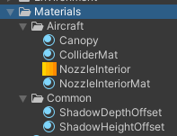

Shared Materials are materials which are common among many different objects. These are found in `Assets/TinyCombatTools/Content/SharedMaterials`.

While it's not strictly required that you use these common materials, it's generally advised in order to maintain commonality with rest of the game. E.g. use the `Canopy` material for the canopies of your aircraft.

When exporting your assets **do not include these materials** in the mod export folder. As long as they reference the shared materials, they will map correctly once imported.

### `NozzleInterior` and Afterburners

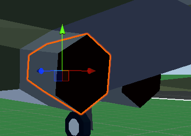

"Nozzle interiors", which are what's used to represent the glowing of the inside of the nozzle when the afterburner is active, have specific requirements that must be met in order to work correctly.

1. Must be its own mesh (see image above)
2. Must have only one material on it

The way it works is that the assigned material will modify the color property to create the effect. When not afterburning, the material will have a black color assigned. When afterburnering, the color will smoothly ramp up to white. When combined with a white emissive value and texture, you get the afterburner effect in Tiny Combat Arena.

For convenience, both the nozzle interior texture and material are provided in `Assets/TinyCombatTools/Content/SharedMaterials`. It's recommended that you use the material provided for your afterburners, and UV map the nozzle interiors of your mesh accordingly.

### Adding Shadows with `ShadowDepthOffset` and `ShadowHeightOffset`

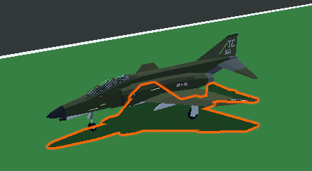

These two shared materials are the most commonly used materials for shadows. As a convention, aircraft shadows use the `ShadowDepthOffset` material, while vehicles use the `ShadowHeightOffset` material.

**It's highly recommend you use these two shared materials for shadows rather than creating your own.**

Stores/munitions do not use shadow meshes. They are generated dynamically at runtime.

## Shaders

### TinyDiffuse

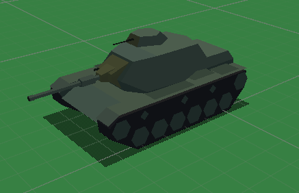

The `TinyDiffuse` shader is the bread and butter of Tiny Combat Arena. It drives the shading of nearly every object in the game and automatically handles the game's unique lighting, coloring, and shading.

Anything that's not a specialty material (i.e. canopies and shadows) should be using this shader.

### TinyCanopy

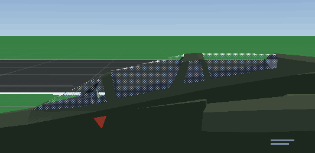

`TinyCanopy` is the shader used for all cockpit canopies in the game. The `Canopy` material as mentioned in [Shared Materials](#shared-materials) is the default implementation that nearly every single aircraft in the game uses.

While everything in Tiny Combat is flat shaded, **it's recommended for the canopy mesh to be smooth shaded**. This allows for the shader to create the smooth highlight contour seen on the top of the canopy.

### TinyShadow

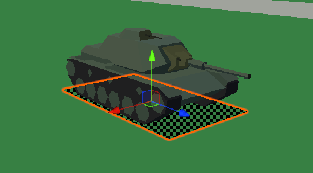

The shader used for shadows for all non-static objects in the game. (Static objects use a separate shadow shader that is not included.) The shadows are dithered when viewed up close, but when viewed from afar become solid to ensure they remain visible.

In order to remain visible when coplanar with the ground, the shadows have two means of "cheating" to make sure they are drawn on top. The `HeightOffset` simply offsets them vertically, while the `DepthOffset` instead pulls them forwards towards the camera.

**It's highly recommended that you use the `ShadowDepthOffset` and `ShadowHeightOffset` as described in the [Adding shadows](#adding-shadows-with-shadowdepthoffset-and-shadowheightoffset) section.**

# Changelog

### v2.2 March 5 2025
* Mod settings can be saved and loaded to make working on multiple mods easier
* When the mod builder opens for the first time you are prompted to select a mod profile
* Updated many of the labels and text fields for clarity, correctness, and consistency

### v2.1 February 7 2025
* Big overhaul of the Asset Bundler to make it into a self-contained Mod Bundler
* Bundler will automatically create a `Mod.json` with details for your mod
* Added support for exporting and generating a mod description with both a thumbnail and preview image
* Added many new fields to the mod definition

### v1.1 October 31 2023
* Renamed the `Materials` folder to `SharedMaterials`
* Removed the `TCADefault` material
* Changed WireExample's material to the `V750Mat`

### v1.0 October 31 2023
* First release
